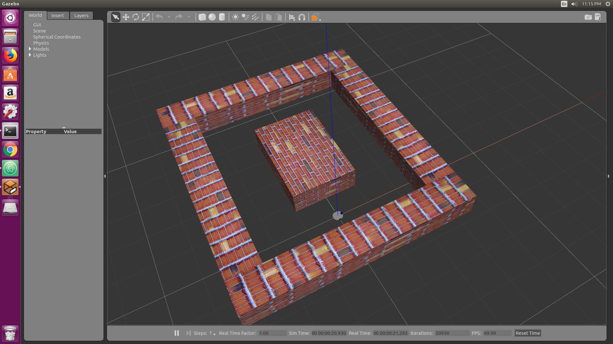
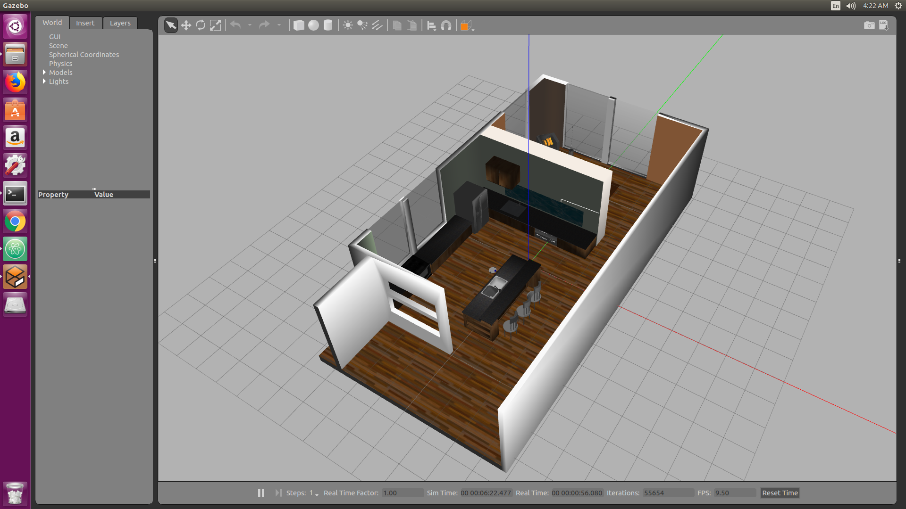

.. nn_class_docs documentation master file, created by
   sphinx-quickstart on Fri Aug 17 17:05:47 2018.
   You can adapt this file completely to your liking, but it should at least
   contain the root `toctree` directive.

#########################
Some insights in reinforcement learning for mobile robots
#########################

.. nn_class_docs documentation master file, created by
   sphinx-quickstart on Fri Aug 17 17:05:47 2018.
   You can adapt this file completely to your liking, but it should at least
   contain the root `toctree` directive.

I have included a variety of environments for testing RL algorithms along with for accessing the sensors ,actuators. Some of these
environments were adapted from open sourced repositories and I do not own the right to them

Maze Brick World
============

Kitchen and Dining World
============

No Obstacle World
============

.. image:: path/noobstacle.jpg
  :width: 400
  :alt: Alternative text

Static Obstacle World
============

.. image:: path/staticobstacle.jpg
  :width: 400
  :alt: Alternative text

Dynamic Obstacle World
============

.. image:: path/dynamicobstacle.jpg
  :width: 400
  :alt: Alternative text
